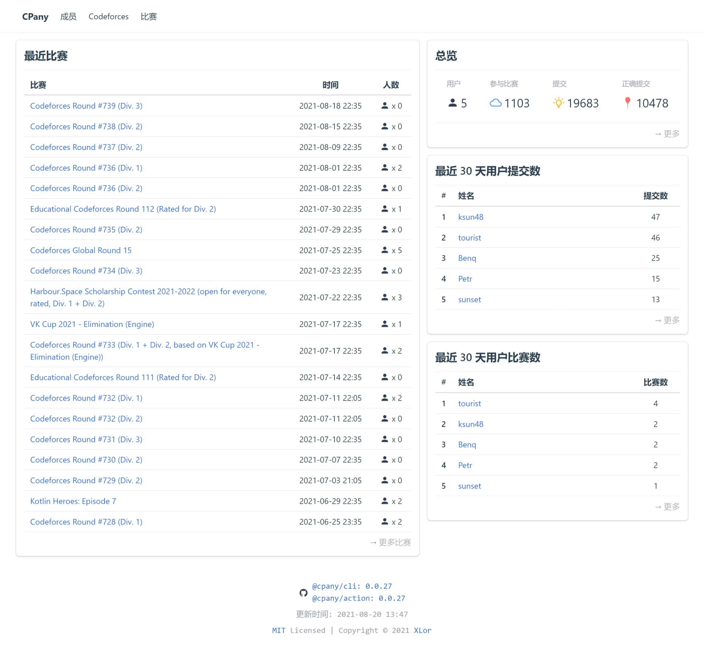

# 🥖 CPany - Competitive Programming Statistic

[](https://github.com/yjl9903/CPany/actions/workflows/build.yml) [](https://app.netlify.com/sites/cpany/deploys)



## Getting Started

Use CPany template [@yjl9903/CPany-Template](https://github.com/yjl9903/CPany-Template) to create your own repository for data storage.

Update config file `cpany.yml`, and push the changes to Github. Then, Github Actions will automatically fetch data and push to your repository.

You can use Github Pages, Netlify, etc. to deploy generated static site.

### Netlify Deploy

The template repository has provided config file `netlify.toml`, so you can just add your repository to Netlify without any configuration.

### Github Pages Deploy

You can use this action [peaceiris/actions-gh-pages](https://github.com/marketplace/actions/github-pages-action) to deploy your site.

Update the action configuration on `.github/workflows/update.yml`:

```yml
jobs:
  update:
    runs-on: ubuntu-latest
    steps:
      - uses: actions/checkout@v2
      - name: Setup node
        uses: actions/setup-node@v1
        with:
          node-version: 14
      - name: Fetch data
        uses: yjl9903/CPany@v0.0.26
      - run: npm install
      - run: npm run build
      - name: Deploy
        uses: peaceiris/actions-gh-pages@v3
        with:
          github_token: ${{ secrets.GITHUB_TOKEN }}
          publish_dir: ./dist
```

## License

MIT License © 2021 [XLor](https://github.com/yjl9903)
