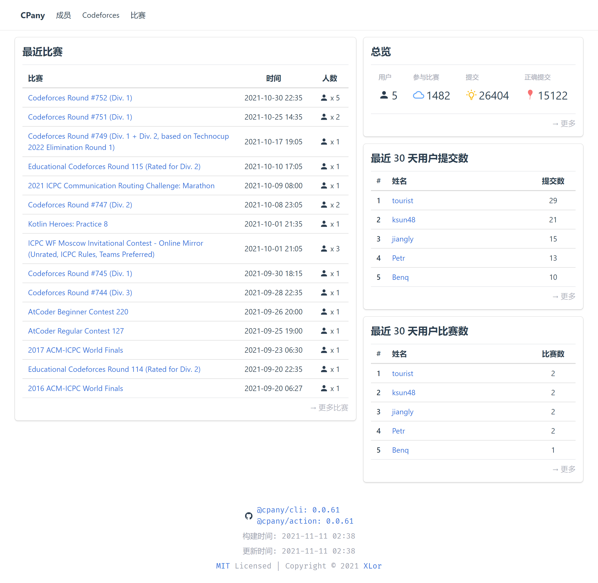

# 🥖 CPany

[](https://www.npmjs.com/package/@cpany/cli) [](https://cpany.dev/) [](https://github.com/cpanyjs/CPany/actions/workflows/build.yml)

**C**ompetitive **P**rogramming Statistic **An**al**y**sis Site Generator.



## Getting Started

Use CPany template [cpanyjs/template](https://github.com/cpanyjs/template) to create your own repository for data storage.

Update config file `cpany.yml`, and push the changes to Github.

Then, Github Actions will automatically fetch data and push to your repository!

## Deploy

You can use Netlify, Vercel, Github Pages, etc. to deploy generated static site.

### Netlify

The template repository has provided Netlify config file `netlify.toml` with the following content.

```toml
[build.environment]
  NODE_VERSION = "14"

[build]
  publish = "dist"
  command = "npm run build"

[[redirects]]
  from = "/*"
  to = "/index.html"
  status = 200
```

Then you can just create a new CPany site with your repository on Netlify.

### Vercel

The template repository has provided Vercel config file `Vercel.json` with the following content.

```json
{
  "rewrites": [
    { "source": "/(.*)", "destination": "/index.html" }
  ]
}
```

Then you can just create a new CPany site with your repository on Vercel.

### Github Pages

The template repository has also provided a workflow `gh-pages.yml`, which will automatically push the generated static site to the branch `gh-pages`. You can just enable Github Pages in the Settings of your repository.

## Run locally

Install [Node.js >= 14](https://nodejs.org/).

Run one of the following commands to install [@cpany/cli](https://www.npmjs.com/package/@cpany/cli) globally.

```bash
# npm
npm i -g @cpany/cli

# yarn
yarn global add @cpany/cli
```

Create an empty foler, and create `cpany.yml` in this new folder.

```bash
# prepare folder
mkdir cpany-data
cd cpany-data
echo "users:" > cpany.yml
echo "  tourist:" >> cpany.yml
echo "    handle/codeforces: tourist" >> cpany.yml
```

Fetch data, and start your static site.

```bash
# fetch data
cpany action

# Start dev server
cpany dev

# Build static site
cpany build
```

## License

MIT License © 2021 [XLor](https://github.com/yjl9903)
